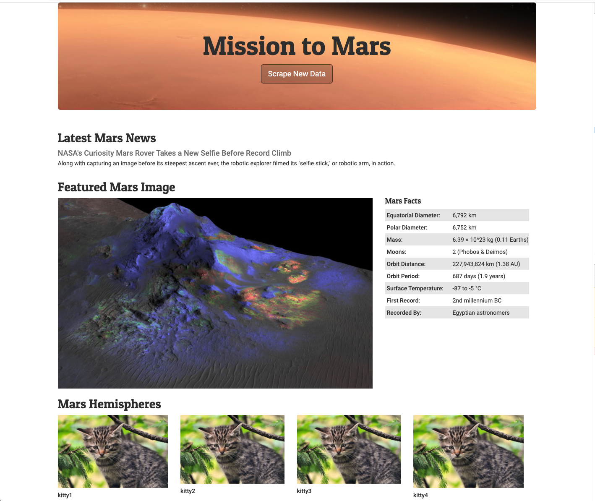

# Mission-to-Mars

## Dependencies

pip install splinter

brew cask install chromedriver

pip install bs4

brew tap mongodb/brew

brew install mongodb-community@4.2

brew services start mongodb-community@4.2

pip install Flask-PyMongo

## Challenge

Data scaping web app.  

Here you will find the latest news on Mars, high-res pictures, interesting fact and if gods are mercy pictures of each of the hemispheres. Today was not a lucky day and we got kitties instead, hope you have better odds.

The view of the app currently:
